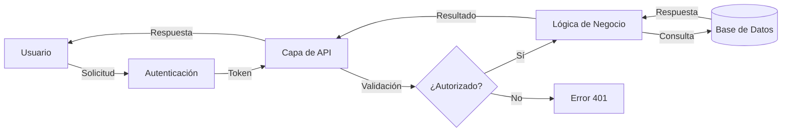

<!--
  ┌─────────────────────────────────────────────────────────────────────────┐
  │  Esto es una PLANTILLA. Antes de publicar tu proyecto:                     │
  │  0. ¿Usas Claude Code? Escribe /instanciar para el arranque guiado.        │
  │  1. Lee TEMPLATE-USAGE.md para saber cómo instanciarla.                    │
  │  2. Reemplaza todos los [PLACEHOLDERS] (búscalos con grep, ver guía).      │
  │  3. Borra los documentos que no apliquen a tu proyecto.                    │
  │  4. Elimina este comentario.                                               │
  └─────────────────────────────────────────────────────────────────────────┘
-->

# [NOMBRE_DEL_PROYECTO]

Descripción breve y concisa del proyecto (1-2 líneas).


## Tabla de Contenidos

- [Descripción](#descripción)
- [Características](#características)
- [Requisitos Previos](#requisitos-previos)
- [Instalación](#instalación)
- [Configuración](#configuración)
- [Uso](#uso)
- [Arquitectura](#arquitectura)
- [Stack Tecnológico](#stack-tecnológico)
- [Scripts Disponibles](#scripts-disponibles)
- [Testing](#testing)
- [Deployment](#deployment)
- [Contribución](#contribución)
- [Troubleshooting](#troubleshooting)
- [Roadmap](#roadmap)
- [Documentación](#documentación)
- [IA / Agentes](#ia--agentes)
- [Soporte](#soporte)
- [Versionado](#versionado)
- [Autores](#autores)
- [Licencia](#licencia)

## Descripción

Descripción detallada del proyecto, su propósito y el problema que resuelve. Explica el contexto y cómo este proyecto aporta valor.

### Flujo de Funcionamiento



## Características

- ✅ Característica principal 1
- ✅ Característica principal 2
- ✅ Característica principal 3
- 🚧 Característica en desarrollo
- 📋 Característica planificada

## Requisitos Previos

Antes de comenzar, asegúrate de tener instalado:

- **[RUNTIME]**: v[VERSION] o superior
- **[GESTOR_DE_PAQUETES]**: v[VERSION] o superior
- **[BASE_DE_DATOS]**: v[VERSION] o superior
- **[OTRA_HERRAMIENTA]**: v[VERSION] o superior

### Accesos Necesarios

- Acceso al repositorio
- Credenciales para [SERVICIO/API]
- [OTROS_ACCESOS] (si aplica)

## Instalación

### 1. Clonar el repositorio

```bash
git clone [URL_REPOSITORIO]
cd [NOMBRE_DEL_PROYECTO]
```

### 2. Instalar dependencias

```bash
[COMANDO_INSTALAR_DEPENDENCIAS]
```

### 3. Configurar variables de entorno

```bash
cp .env.example .env
# Edita .env con tus credenciales
```

### 4. Inicializar la base de datos (si aplica)

```bash
[COMANDO_MIGRACIONES]
[COMANDO_SEEDS]
```

## Configuración

Las variables de entorno se documentan en [`.env.example`](.env.example). Cópialo a `.env` y completa los valores para tu entorno.

> Nunca subas tu archivo `.env` con valores reales al repositorio. Ver [SECURITY.md](SECURITY.md) y [`docs/conventions/secrets.md`](docs/conventions/secrets.md).

## Uso

### Desarrollo local

```bash
[COMANDO_INICIAR_DESARROLLO]
# La aplicación quedará disponible en http://localhost:[PUERTO]
```

### Ejemplos de uso

```bash
# Ejemplo de comando o llamada representativa
[EJEMPLO]
```

Para el contrato completo de la API, ver [`docs/architecture/api.md`](docs/architecture/api.md).

## Arquitectura

Resumen de cómo está construido el sistema. Detalle completo en [`docs/architecture/architecture.md`](docs/architecture/architecture.md).

## Stack Tecnológico

Resumen de las tecnologías principales. Inventario completo (con versiones y justificación) en [`docs/architecture/stack.md`](docs/architecture/stack.md).

## Scripts Disponibles

```bash
[COMANDO_DESARROLLO]   # Iniciar en modo desarrollo
[COMANDO_BUILD]        # Compilar para producción
[COMANDO_TEST]         # Ejecutar tests
[COMANDO_LINT]         # Linting / formato
```

## Testing

```bash
[COMANDO_TEST]            # Todos los tests
[COMANDO_TEST_COBERTURA]  # Con reporte de cobertura
```

Convenciones de testing en [`docs/conventions/testing.md`](docs/conventions/testing.md).

## Deployment

| Ambiente   | URL              | Rama      | Deploy     |
| ---------- | ---------------- | --------- | ---------- |
| Desarrollo | [URL_DEV]        | `develop` | Automático |
| Staging    | [URL_STAGING]    | `staging` | Automático |
| Producción | [URL_PRODUCCION] | `main`    | Manual     |

Procedimiento detallado en [`docs/conventions/deploy.md`](docs/conventions/deploy.md).

## Contribución

Lee la [Guía de Contribución](CONTRIBUTING.md) para conocer el flujo de trabajo (Git Flow), los estándares de código, el formato de commits (Conventional Commits) y el proceso de Pull Requests.

## Troubleshooting

#### Error: "[MENSAJE_DE_ERROR_COMÚN]"

```bash
# Pasos para diagnosticar y resolver
[COMANDO]
```

### Obtener ayuda

1. Revisa la [documentación](docs/README.md).
2. Busca en los [issues existentes]([URL_REPOSITORIO]/issues).
3. Abre un nuevo issue o contacta a [EMAIL_SOPORTE].

## Roadmap

Visión y próximos pasos en [`docs/product/roadmap.md`](docs/product/roadmap.md).

## Documentación

Toda la documentación vive en [`docs/`](docs/README.md):

| Documento                                                                | Responde a                           |
| ------------------------------------------------------------------------ | ------------------------------------ |
| [`docs/architecture/architecture.md`](docs/architecture/architecture.md) | ¿Cómo está construido?               |
| [`docs/architecture/stack.md`](docs/architecture/stack.md)               | ¿Con qué tecnologías?                |
| [`docs/architecture/database.md`](docs/architecture/database.md)         | ¿Qué entidades y relaciones?         |
| [`docs/architecture/api.md`](docs/architecture/api.md)                   | ¿Qué endpoints expone?               |
| [`docs/architecture/auth.md`](docs/architecture/auth.md)                 | ¿Cómo se autentica y autoriza?       |
| [`docs/architecture/design.md`](docs/architecture/design.md)             | ¿Cómo se diseña y por qué?           |
| [`docs/product/business-model.md`](docs/product/business-model.md)       | ¿Por qué existe / cómo genera valor? |
| [`docs/product/roadmap.md`](docs/product/roadmap.md)                     | ¿Hacia dónde va?                     |
| [`docs/decisions/`](docs/decisions/README.md)                            | ¿Por qué tomamos cada decisión?      |
| [`docs/conventions/`](docs/conventions/README.md)                        | ¿Cómo trabajamos en este repo?       |

## IA / Agentes

Esta plantilla está **lista para IA**. El contexto para agentes vive en
[`AGENTS.md`](AGENTS.md) (canónico; [`CLAUDE.md`](CLAUDE.md) lo importa para
Claude Code). Incluye [subagentes](.claude/agents) y [skills](.claude/skills)
de ejemplo adaptables, y un flujo ligero basado en especificaciones en
[`specs/`](specs/README.md). Consulta
[`docs/conventions/ai-agents.md`](docs/conventions/ai-agents.md) para las reglas.

## Soporte

¿Problemas o sugerencias? Abre un issue en [el repositorio]([URL_REPOSITORIO]/issues) o escribe a [EMAIL_SOPORTE].

## Versionado

Usamos [Git](https://git-scm.com) para el control de versiones y seguimos [Semantic Versioning](https://semver.org/). Consulta las [etiquetas]([URL_REPOSITORIO]/tags) para ver las versiones disponibles y el [CHANGELOG](CHANGELOG.md).

## Autores

- **[AUTOR]** — _Trabajo inicial_ — [@[USUARIO_GITHUB]](https://github.com/[USUARIO_GITHUB])

Consulta también el historial de commits para ver quién ha trabajado en el proyecto.

## Licencia

Este proyecto está bajo la licencia [MIT](LICENSE).
