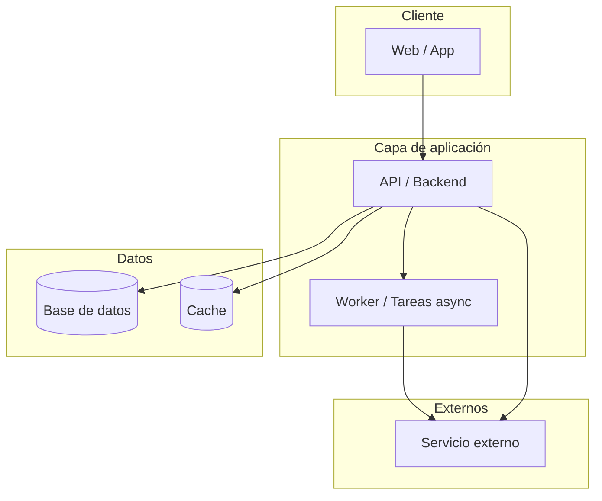
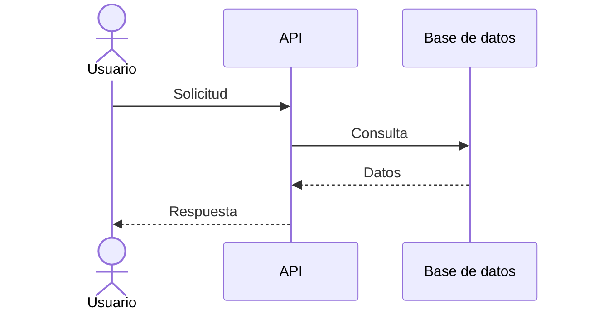

# [NOMBRE_DEL_PROYECTO] — Arquitectura

> Vista de alto nivel de cómo está construido el sistema y cómo se reparten las
> responsabilidades. Para el stack real (versiones, librerías) ver
> [`stack.md`](stack.md). Para el negocio ver
> [`../product/business-model.md`](../product/business-model.md).
>
> **Última actualización**: [FECHA]

## Diagrama

## Componentes

| Componente     | Responsabilidad                    | Tecnología   |
| -------------- | ---------------------------------- | ------------ |
| [COMPONENTE_1] | [Qué hace y de qué es responsable] | [TECNOLOGÍA] |
| [COMPONENTE_2] | [Qué hace y de qué es responsable] | [TECNOLOGÍA] |
| [COMPONENTE_3] | [Qué hace y de qué es responsable] | [TECNOLOGÍA] |

## Decisiones clave

| Decisión     | Razón             |
| ------------ | ----------------- |
| [DECISIÓN_1] | [Por qué se tomó] |
| [DECISIÓN_2] | [Por qué se tomó] |

> El detalle y las alternativas de cada decisión relevante se registran como
> ADRs en [`../decisions/`](../decisions/README.md).

## Reglas no negociables

- [Invariante o regla del sistema que nunca debe romperse].
- [Otra regla].

## Flujos principales

## Referencias

- [`stack.md`](stack.md) — stack tecnológico y versiones.
- [`database.md`](database.md) — modelo de datos.
- [`auth.md`](auth.md) — autenticación y autorización.
- [`api.md`](api.md) — contrato de API.
- [`../conventions/`](../conventions/README.md) — convenciones de trabajo.
