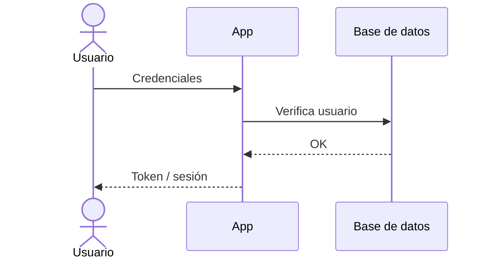

# Autenticación y Autorización

> Cómo se autentican y autorizan los usuarios en **[NOMBRE_DEL_PROYECTO]**.
> Para las reglas transversales ver [`../conventions/authentication.md`](../conventions/authentication.md).
>
> **Última actualización**: [FECHA]

## Visión general

- **Método de autenticación**: [sesión / JWT / OAuth / SSO].
- **Almacenamiento de credenciales**: [dónde y cómo].
- **Hashing de contraseñas**: [bcrypt / argon2 / …].

## Modelo de identidad

| Concepto       | Descripción                            |
| -------------- | -------------------------------------- |
| Usuario        | [Qué representa, campos clave]         |
| Sesión / Token | [Cómo se representa una sesión activa] |
| Roles          | [Roles existentes y su significado]    |

## Flujo de registro / login

## Gestión de sesiones / tokens

- **Expiración**: [TTL].
- **Renovación**: [refresh tokens / rotación].
- **Revocación**: [cómo se invalida una sesión].

## Autorización

- **Modelo**: [RBAC / ABAC / permisos por recurso].
- **Dónde se valida**: siempre en el servidor, en cada request.
- **Roles y permisos**:

| Rol     | Permisos          |
| ------- | ----------------- |
| [ROL_1] | [Qué puede hacer] |
| [ROL_2] | [Qué puede hacer] |

## Proveedores externos (OAuth / SSO)

- [Proveedor], validación server-side, datos que se consumen.

## Recuperación de cuenta

- [Flujo de reset de contraseña, cambio de email, verificación].

## Consideraciones de seguridad

Ver [SECURITY.md](../../SECURITY.md) para la política completa.
