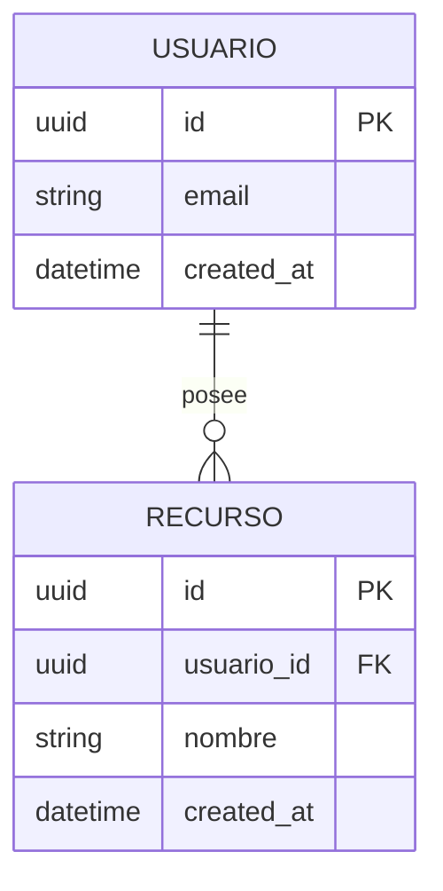

# Modelo de Datos

> Esquema, entidades y relaciones de **[NOMBRE_DEL_PROYECTO]**.
> Para las **reglas y estándares** de modelado (nomenclatura, tipos, índices)
> ver [`../conventions/database.md`](../conventions/database.md).
>
> **Última actualización**: [FECHA]

## Diagrama Entidad-Relación

## Entidades principales

### [ENTIDAD_1]

- **Propósito**: [Qué representa].
- **Campos clave**: [campo (tipo) — descripción].
- **Relaciones**: [con qué otras entidades y con qué cardinalidad].

### [ENTIDAD_2]

- **Propósito**: [Qué representa].
- **Campos clave**: [campo (tipo) — descripción].
- **Relaciones**: [con qué otras entidades y con qué cardinalidad].

## Relaciones y cardinalidad

| Relación                  | Cardinalidad | Notas                 |
| ------------------------- | ------------ | --------------------- |
| [ENTIDAD_A] → [ENTIDAD_B] | 1:N          | [Regla de integridad] |

## Índices y restricciones

- [Índice/restricción importante y por qué existe].
- [Restricción de unicidad, FK, check, etc.].

## Migraciones y versionado del esquema

- [Cómo se generan y aplican las migraciones — `[COMANDO_MIGRACIONES]`].
- [Política de migraciones reversibles / no destructivas].

## Datos semilla (seeds)

- [Qué datos base se cargan y con qué comando — `[COMANDO_SEEDS]`].
